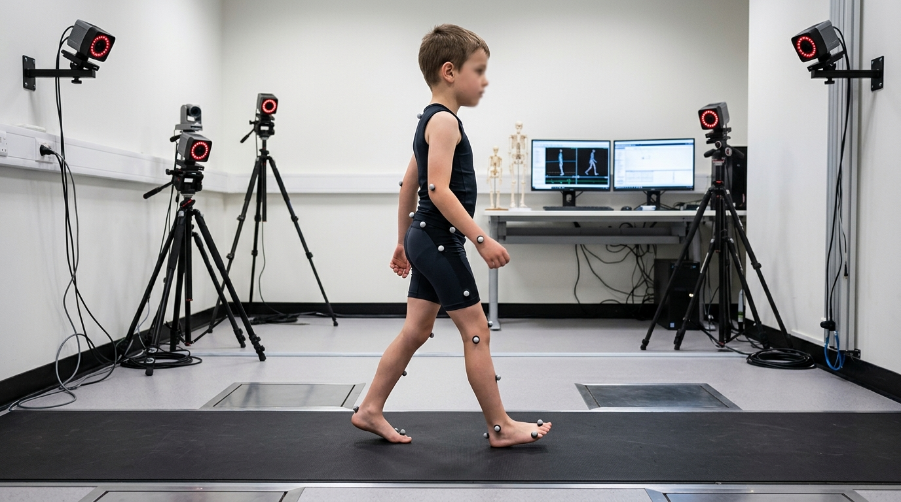

# Gait-Kinematics-SPM

# 1D Statistical Parametric Mapping (SPM) for Gait Kinematics Analysis

A robust Python tool tailored for biomechanical analysis of human gait. This repository implements **1D Cluster Permutation Inference** (both two-sample and paired t-tests) to compare lower-extremity joint kinematics (Hip, Knee, and Ankle) across the gait cycle (0-100%).

The plotting system is engineered for high-impact journal publications, incorporating **Perry's 8 Gait Subphases** as an analytical overlay.

## 🚀 Key Features

- **Advanced Statistical Inference:** Built-in 1D cluster-mass permutation tests (`twosample_cluster_perm` & `paired_cluster_perm`) preventing the multi-comparison problem in continuous time-series data.
- **Biomechanical Subphase Overlay:** Automated boundary segmentation for the 8 Perry subphases (IC, LR, MS, TS, PSw, ISw, MSw, TSw).
- **Publication-Ready Visualization (3-Panel Plots):**
  1. *Panel 1:* Group mean trajectories with $\pm$SD shaded bounds, color-coded by clinical conventions.
  2. *Panel 2:* Continuous $SPM\{t\}$ curve plotted against critical thresholds ($\pm t^*$) with significant clusters shaded in gray.
  3. *Panel 3:* Horizon bar charts highlighting regions of statistical significance.
- **Comprehensive Data Export:** Multivalent spreadsheet generation (`xlsx` and `csv`) extracting detailed time-series metrics and cluster-level descriptive data (mass, p-values, direction, and extent).
- **Robust CLI:** Built with `argparse` allowing execution via terminal or integration into automated pipelines (supports both trial-level and subject-level grouping).

## 🛠️ Installation & Dependencies

Ensure you have Python 3.8+ installed. Clone this repository and install the dependencies:

```bash
git clone [https://github.com/AliJafari000/Gait-Kinematics-SPM.git](https://github.com/AliJafari000/Gait-Kinematics-SPM.git)
cd Gait-Kinematics-SPM
pip install -r requirements.txt
